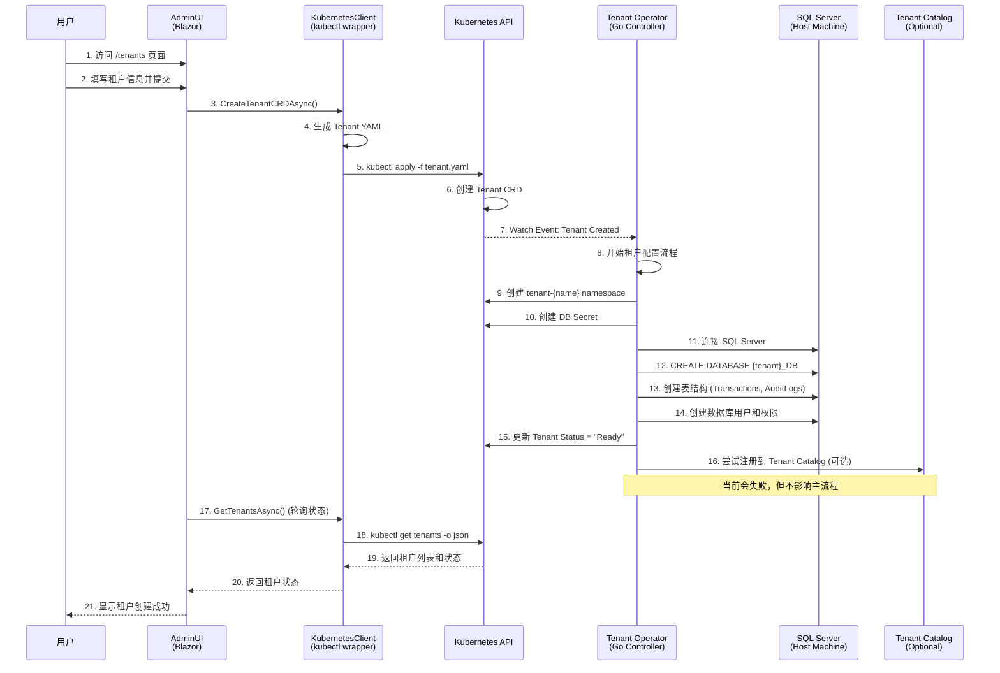

# Multi-tenant Medical Platform - Current Architecture Flow

## 系统架构流程图

```mermaid
graph TB
    %% User Interface Layer
    subgraph "User Interface Layer"
        AdminUI[AdminUI<br/>Port: 5093<br/>Blazor Server]
        Browser[Web Browser<br/>http://localhost:5093]
    end

    %% Application Services Layer
    subgraph "Application Services Layer"
        TenantCatalog[Tenant Catalog Service<br/>Port: 8080<br/>ASP.NET Core API]
        DeviceRegistry[Device Registry Service<br/>Port: 8081<br/>ASP.NET Core API]
        MedLogicService[MedLogic Service<br/>ASP.NET Core API]
    end

    %% Kubernetes Orchestration Layer
    subgraph "Kubernetes Cluster (Minikube)"
        subgraph "platform-system namespace"
            TenantOperator[Tenant Operator<br/>Custom Controller<br/>Go Application]
            TenantCatalogPod[tenant-catalog pod]
            DeviceRegistryPod[device-registry pod]
            TenantOperatorPod[tenant-operator pod]
        end
        
        subgraph "Tenant CRDs"
            TenantCRD[Tenant Custom Resource<br/>tenants.medlogic.io/v1]
        end
        
        subgraph "Dynamic Tenant Namespaces"
            TenantNS[tenant-{name} namespace<br/>Auto-created per tenant]
            TenantSecret[DB Secrets<br/>tenant-{name}-db-secret]
        end
    end

    %% Data Layer
    subgraph "Data Layer"
        SQLServer[SQL Server<br/>host.minikube.internal:1433<br/>Running on Host Machine]
        TenantDB1[{tenant1}_DB<br/>Auto-created Database]
        TenantDB2[{tenant2}_DB<br/>Auto-created Database]
    end

    %% Infrastructure Layer
    subgraph "Infrastructure"
        Minikube[Minikube Cluster<br/>Local Kubernetes]
        HostMachine[Host Machine<br/>Windows]
    end

    %% Flow Connections
    Browser --> AdminUI
    AdminUI --> |HTTP API Calls| TenantCatalog
    AdminUI --> |HTTP API Calls| DeviceRegistry
    AdminUI --> |kubectl commands| TenantCRD
    
    TenantCatalog --> TenantCatalogPod
    DeviceRegistry --> DeviceRegistryPod
    
    TenantOperator --> |Watches| TenantCRD
    TenantOperator --> |Creates| TenantNS
    TenantOperator --> |Creates| TenantSecret
    TenantOperator --> |Provisions| SQLServer
    
    TenantOperatorPod --> |SQL Commands| SQLServer
    SQLServer --> TenantDB1
    SQLServer --> TenantDB2
    
    Minikube --> HostMachine
    
    %% Styling
    classDef uiLayer fill:#e1f5fe
    classDef serviceLayer fill:#f3e5f5
    classDef k8sLayer fill:#e8f5e8
    classDef dataLayer fill:#fff3e0
    classDef infraLayer fill:#fafafa
    
    class AdminUI,Browser uiLayer
    class TenantCatalog,DeviceRegistry,MedLogicService serviceLayer
    class TenantOperator,TenantCatalogPod,DeviceRegistryPod,TenantOperatorPod,TenantCRD,TenantNS,TenantSecret k8sLayer
    class SQLServer,TenantDB1,TenantDB2 dataLayer
    class Minikube,HostMachine infraLayer
```

## 租户创建流程详细图



## 当前系统状态和配置

### 运行中的服务

| 服务 | 状态 | 端口 | 位置 |
|------|------|------|------|
| AdminUI | ✅ 运行中 | 5093 | Host Machine |
| Tenant Catalog | ✅ 运行中 | 8080 | Kubernetes Pod |
| Device Registry | ✅ 运行中 | 8081 | Kubernetes Pod |
| Tenant Operator | ✅ 运行中 | 8080/8081 | Kubernetes Pod |
| SQL Server | ✅ 运行中 | 1433 | Host Machine |
| Minikube | ✅ 运行中 | - | Host Machine |

### 数据流向

1. **用户交互**: Browser → AdminUI (Blazor Server)
2. **租户管理**: AdminUI → KubernetesClient → kubectl → Kubernetes API
3. **自动化配置**: Tenant Operator 监听 CRD 变化
4. **数据库操作**: Tenant Operator → SQL Server (host.minikube.internal:1433)
5. **状态同步**: Kubernetes API → AdminUI (通过 kubectl 查询)

### 关键配置

```yaml
# Tenant CRD 示例
apiVersion: tenants.medlogic.io/v1
kind: Tenant
metadata:
  name: test-hospital
spec:
  displayName: "Test Hospital"
  db:
    mode: perDatabase
    server: "host.minikube.internal,1433"
    database: test_hospital_DB
  throttling:
    rps: 100
  slo:
    availability: "99.9%"
    p95_latency_ms: 1000
```

### 网络连接

- **AdminUI → Kubernetes**: 通过 kubectl 命令行工具
- **Kubernetes → SQL Server**: host.minikube.internal:1433
- **AdminUI → Services**: HTTP API 调用 (可选，主要用于显示)
- **Browser → AdminUI**: http://localhost:5093

## 已知问题和解决方案

### 1. Tenant Catalog 同步问题
- **问题**: Tenant Operator 无法将租户信息注册到 Tenant Catalog
- **影响**: 不影响核心功能，只是数据不同步
- **解决方案**: AdminUI 直接从 Kubernetes 获取租户信息

### 2. 健康检查警告
- **问题**: Tenant Operator 偶尔出现健康检查超时
- **影响**: 不影响功能，只是日志警告
- **状态**: 服务正常运行

### 3. JSON 序列化问题
- **问题**: 枚举类型序列化不一致
- **解决方案**: 统一使用字符串类型，添加 JsonStringEnumConverter

## 成功验证的功能

✅ **E2E 测试脚本**: 可以成功创建租户和数据库  
✅ **Tenant Operator**: 正常监听和处理 CRD  
✅ **数据库自动创建**: SQL Server 数据库和表结构  
✅ **Kubernetes 资源**: Namespace 和 Secret 创建  
✅ **AdminUI 启动**: 无错误启动，服务注册正确  

## 下一步测试

1. 通过 AdminUI 创建租户
2. 验证数据库自动创建
3. 检查租户状态更新
4. 测试多租户隔离